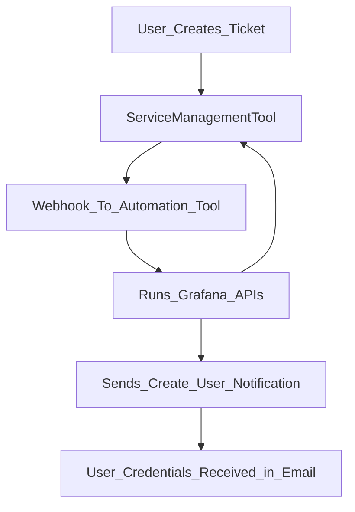

```mermaid
graph TD;
    User_Creates_Ticket-->ServiceManagementTool
    ServiceManagementTool-->Webhook_To_Automation_Tool;
    Webhook_To_Automation_Tool-->Runs_Grafana_APIs
    Runs_Grafana_APIs-->Sends_Create_User_Notification;
    Sends_Create_User_Notification-->User_Credentials_Received_in_Email;
    Runs_Grafana_APIs-->ServiceManagementTool
```

# Grafana API Authentication

- Basic Authentication

- Token Based Authentication
