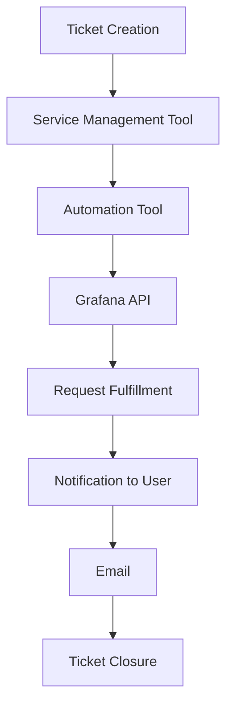

# Why to Learn Graphana APIs

- Customization: Understanding Grafana APIs allows you to customize and extend the functionality of Grafana, tailoring it to your specific needs. You can create custom visualizations, panels, dashboards, and even automate certain tasks.

- Integration: With Grafana APIs, you can integrate Grafana with other tools and services, enabling seamless data flow between different systems. This integration capability is crucial in modern software ecosystems.

- Automation: APIs allow you to automate tasks within Grafana, such as provisioning data sources, creating dashboards programmatically, or managing users and permissions. This automation can significantly improve efficiency and reduce manual effort.

- Advanced Analytics: Accessing Grafana's APIs enables you to extract data for more advanced analytics, data processing, or machine learning purposes beyond what the standard Grafana interface provides.

- Extensibility: By learning the Grafana APIs, you gain the ability to develop plugins or extensions for Grafana, expanding its capabilities and integrating new features.

# Grafana API Authentication

- Basic Authentication

- Token Based Authentication
